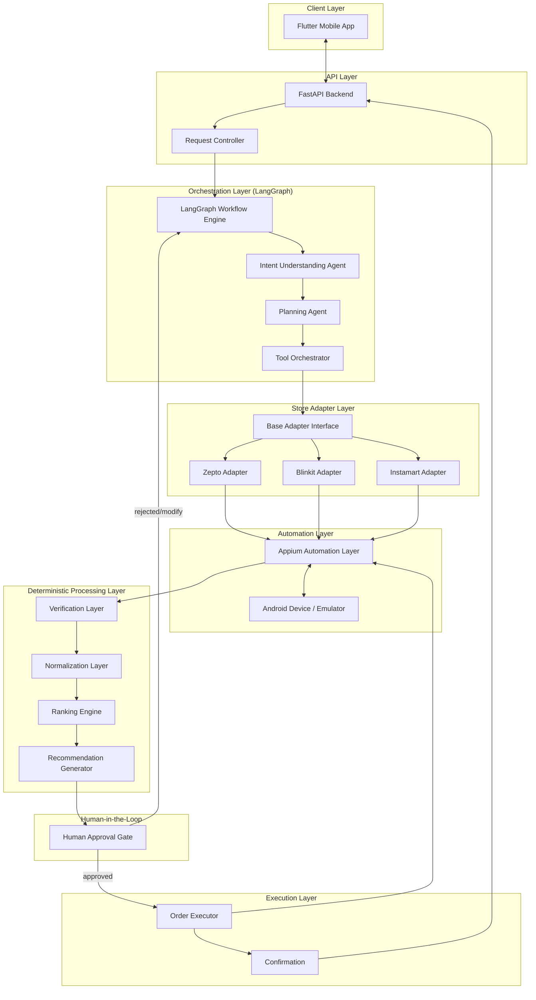
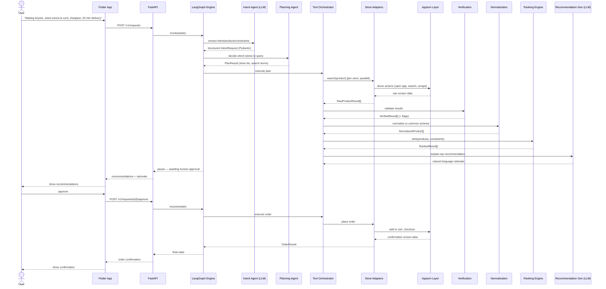
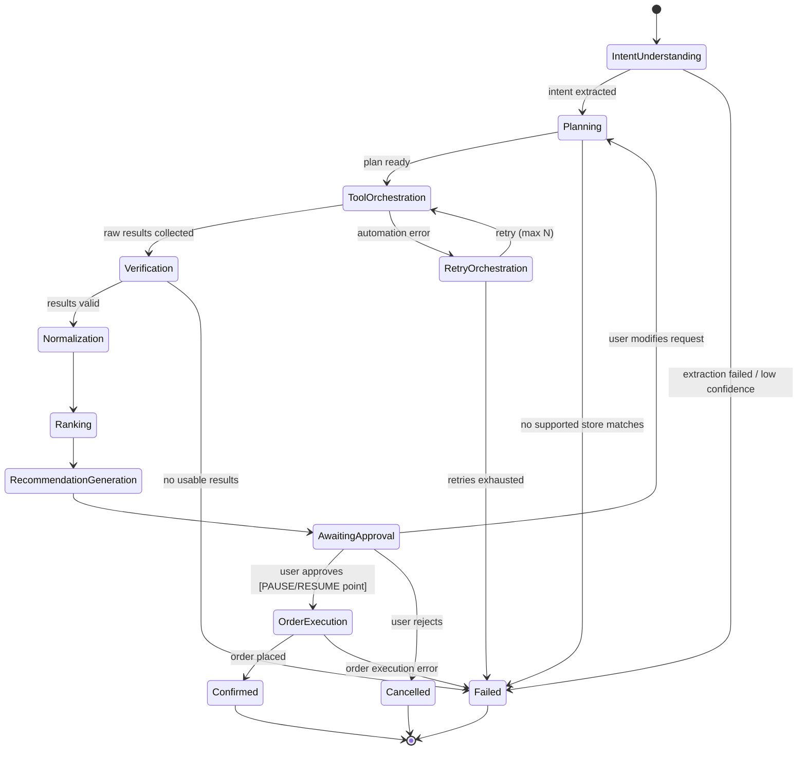
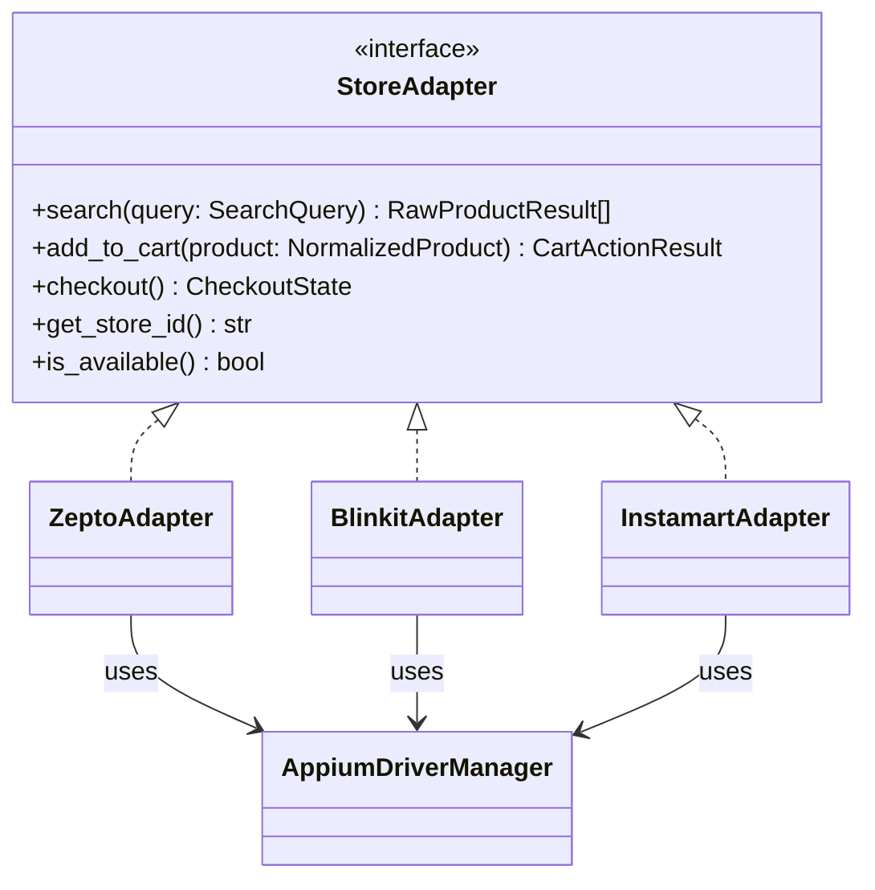
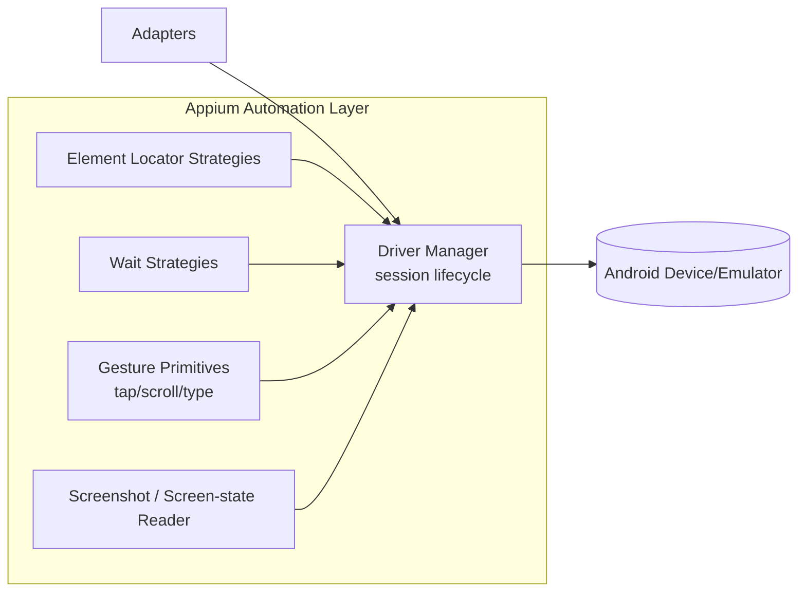
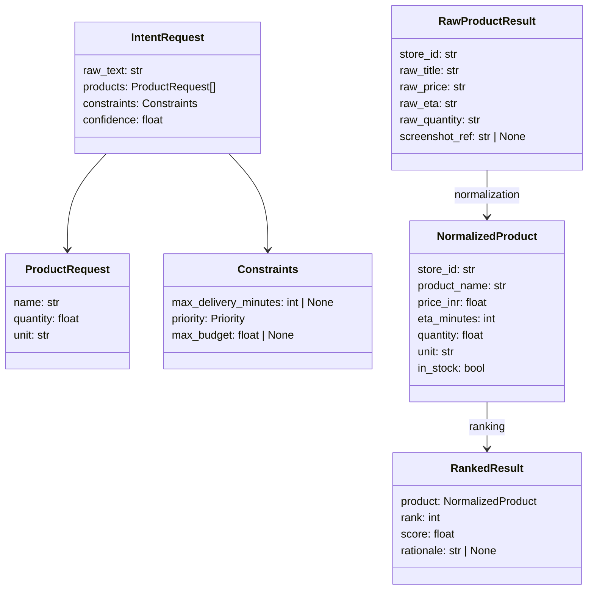

# Phase 0 — System Architecture & Design
## Intent-to-Action Shopping Agent for Android Quick Commerce

> **Status:** Design only. No code, no folders, no implementation.
> **Goal of this phase:** Establish a shared, unambiguous architectural foundation so every later phase is a mechanical extension of a decision already made here — not a new design conversation.

---

## 1. System Overview

The system takes a natural-language shopping intent from a user ("I'm making biryani, need onions and curd, cheapest option delivering within 20 minutes"), turns it into a structured request, searches multiple Android quick-commerce apps via UI automation, normalizes and ranks the results deterministically, asks the human to approve, and then places the order.

Three things are deliberately separated, because conflating them is the single most common way agentic systems become unreliable and unmaintainable:

| Concern | Owner | Why |
|---|---|---|
| Reasoning ("what does the user want?", "why is this the best pick?") | LLM (Qwen2.5-7B via Ollama) | Language understanding and explanation generation are probabilistic tasks — that's what LLMs are good at. |
| Decisions with a right answer (ranking, filtering, validation) | Deterministic Python | Money and correctness should never depend on sampling. A ranking must be reproducible and auditable. |
| Physical UI interaction (tapping, typing, reading screen state) | Appium | Mechanical execution against a real app UI. The LLM must never be "in the loop" of an actual tap sequence — see Rule 4 in the master prompt. |

This 3-way split is the backbone of every design decision below.

---

## 2. High-Level Component Architecture



**Key architectural principle: every arrow into the Adapter layer and below goes through an interface, never a concrete class.** This is what lets Phase 7 return mocked data and Phase 8 swap in real Appium calls without touching anything upstream.

---

## 3. Sequence Diagram (Happy Path)



---

## 4. LangGraph Workflow Diagram

LangGraph is the **stateful orchestrator**, not a chatbot loop. Its job is to hold a typed state object, route between nodes based on that state, and be pausable/resumable at exactly one point: human approval.



**Why `AwaitingApproval` is a first-class graph node, not a side-channel:** LangGraph's checkpointing lets us persist state at this node and resume later (even after a process restart), which is exactly the semantics we want for "wait for human approval" — see Phase 13.

---

## 5. Agent & Component Responsibilities

### 5.1 Which components are AI (LLM-backed)

| Component | Responsibility | Why AI is appropriate here |
|---|---|---|
| Intent Understanding Agent | Parse free text → structured `IntentRequest` (products, quantities, constraints, priorities) | Natural language is inherently ambiguous; needs semantic understanding, not regex. |
| Planning Agent | Decide *which* supported stores are worth querying given the intent (e.g., skip a store that doesn't carry groceries) | A light reasoning task over a small, known catalog of stores — cheap for an LLM, brittle as a rules engine as store count grows. |
| Recommendation Generator | Turn a deterministic ranked result into a natural-language explanation ("Zepto is cheapest by ₹12 and delivers in 14 min, within your 20-min limit") | Explanation generation is inherently linguistic. The *ranking itself* is never done here. |

### 5.2 Which components are deterministic (pure Python)

| Component | Responsibility | Why NOT AI |
|---|---|---|
| Tool Orchestrator | Fan-out/fan-in calls to adapters, timeout handling, retries | Control flow, not reasoning. |
| Verification Layer | Reject malformed/duplicate/missing/invalid-price results | Must be deterministic and auditable — no hallucinated validation. |
| Normalization Layer | Map each store's raw schema → common `NormalizedProduct` schema | Pure data transformation with fixed rules. |
| Ranking Engine | Sort/filter by cheapest/fastest/best-value/constraints | **Money and correctness must never depend on an LLM.** This is explicitly called out in the master rules (Phase 11: "Do not use an LLM"). |
| Order Executor | Add to cart, checkout navigation, pre-payment verification | Safety-critical; must be deterministic and never auto-confirm payment. |

### 5.3 Non-agent infrastructure

| Component | Responsibility |
|---|---|
| Store Adapters | Translate a normalized `SearchQuery` into store-specific Appium action sequences, and store-specific screen output into a `RawProductResult`. One adapter per app, identical interface. |
| Appium Automation Layer | Low-level device/driver management: session lifecycle, element waits, screenshots, gesture primitives. Knows nothing about "products" or "biryani" — only about UI elements. |

---

## 6. Store Adapter Architecture

**Rule (from master prompt, rules 5–7):** every external app is accessed through an adapter; every adapter exposes the same interface; business logic never depends on Appium directly.



Design points:

- **Interface, not base class with shared implementation.** Each store's UI is different enough (element locators, navigation flow, screen layouts) that shared logic would create fragile coupling. Composition (each adapter *holds* an `AppiumDriverManager`) is preferred over inheritance, per the coding standards.
- **Adapters return raw, store-shaped data.** Normalization happens centrally (Phase 10), not inside each adapter — this avoids duplicating normalization logic three times and keeps adapters focused only on "how do I get data out of this app."
- **Adapters are swappable at the Tool Orchestrator boundary** via dependency injection — this is what makes Phase 7 (mocked) → Phase 8 (real Appium) a non-breaking change.

---

## 7. Appium Automation Layer Architecture



- **Driver Manager** owns the Appium session (start, restart on crash, teardown) — adapters never touch a raw `webdriver` session directly, only through this manager, so retry/recovery logic lives in one place.
- **Wait strategies** are centralized (explicit waits, not `time.sleep`) since quick-commerce apps have variable network-dependent load times.
- Screenshots exist from Phase 6 onward primarily for **debugging and verification**, not as the primary data-extraction path (element trees are more reliable and faster than OCR-on-screenshot, which is a fallback strategy we can revisit later if locators prove unstable).

---

## 8. Folder & Package Structure (Target — created incrementally from Phase 1 onward)

```
quasis-food-ordering/
├── backend/
│   ├── app/
│   │   ├── core/                   # config, DI container, logging setup
│   │   ├── automation/             # Swiggy on-device uiautomator2 automation
│   │   ├── food_ordering/          # food ordering domain models
│   │   ├── shared/                 # shared utilities
│   │   ├── grocery/                # Quick-commerce grocery agent (Zepto/Blinkit/Instamart)
│   │   │   ├── api/                # FastAPI routers, versioned (v1/)
│   │   │   │   └── v1/
│   │   │   ├── domain/             # Pydantic models / entities (framework-agnostic)
│   │   │   │   ├── intent.py
│   │   │   │   ├── product.py
│   │   │   │   ├── constraints.py
│   │   │   │   └── order.py
│   │   │   ├── agents/             # LLM-backed reasoning components
│   │   │   │   ├── intent_agent.py
│   │   │   │   ├── planning_agent.py
│   │   │   │   └── recommendation_agent.py
│   │   │   ├── graph/              # LangGraph state, nodes, edges
│   │   │   │   ├── state.py
│   │   │   │   ├── nodes/
│   │   │   │   └── workflow.py
│   │   │   ├── adapters/           # Store adapters
│   │   │   │   ├── base.py
│   │   │   │   ├── zepto/
│   │   │   │   ├── blinkit/
│   │   │   │   └── instamart/
│   │   │   ├── automation/         # Appium layer
│   │   │   │   ├── driver_manager.py
│   │   │   │   ├── waits.py
│   │   │   │   └── gestures.py
│   │   │   ├── processing/         # deterministic layers
│   │   │   │   ├── verification.py
│   │   │   │   ├── normalization.py
│   │   │   │   └── ranking.py
│   │   │   ├── services/           # orchestration glue (tool orchestrator etc.)
│   │   │   └── prompts/            # prompt templates
│   │   └── main.py
│   └── tests/                      # mirrors backend/app structure
│       ├── automation/
│       ├── core/
│       └── grocery/                # mirrors app/grocery/ structure
├── apps/mobile/                    # React Native / Expo mobile app
├── services/backend/               # TypeScript Fastify/SSE food ordering backend
└── docs/grocery/                   # grocery architecture docs (this file lives here)
```

This is a **modular monolith**: one deployable backend process, but internally partitioned along the same seams a future microservice split would use (`agents/`, `adapters/`, `processing/` are each independently extractable — see §12).

---

## 9. Dependency Graph (Layered, Acyclic)

```mermaid
flowchart TB
    api[api] --> graph[graph]
    graph --> agents[agents]
    graph --> services[services]
    services --> adapters[adapters]
    services --> processing[processing]
    adapters --> automation[automation]
    agents --> domain[domain]
    services --> domain
    processing --> domain
    adapters --> domain
    automation --> domain
```

Rule enforced here: **`domain/` depends on nothing; everything depends on `domain/`.** `processing/` (ranking, normalization, verification) never imports from `automation/` or `adapters/` — this is the concrete enforcement of master rule #7 ("business logic must never depend on Appium").

---

## 10. API Contracts (v1, high-level — full OpenAPI schema arrives in Phase 2)

| Method | Path | Purpose |
|---|---|---|
| `POST` | `/v1/requests` | Submit a natural-language shopping request; returns a `request_id` and, once processing reaches the approval gate, a set of recommendations. |
| `GET` | `/v1/requests/{id}` | Poll current state of a request (useful while the graph is running). |
| `POST` | `/v1/requests/{id}/approve` | Resume a paused graph and execute the order. |
| `POST` | `/v1/requests/{id}/reject` | Cancel the request. |
| `POST` | `/v1/requests/{id}/modify` | Return to planning with an amended constraint set. |
| `GET` | `/v1/health` | Liveness/readiness probe. |

All endpoints versioned under `/v1` from day one so that breaking changes in later phases don't require a client-side migration story — a new `/v2` can be added alongside.

---

## 11. Pydantic Data Contracts (core shapes — full field-level definitions in Phase 4/10)



Every boundary between layers in §2 is crossed exclusively via one of these Pydantic models — never a raw `dict`. This is what makes "every module independently testable" (rule 14) actually true: each layer's unit tests can construct these models directly without needing the layer before it.

---

## 12. Error Handling Strategy

| Failure class | Where caught | Strategy |
|---|---|---|
| LLM returns invalid/unparseable JSON | Intent/Planning/Recommendation agents | Pydantic validation with `retry_on_validation_error` (bounded retries with a corrective re-prompt); falls back to `Failed` graph node after N attempts. |
| Appium session crash / element not found | Automation layer | Driver Manager attempts session restart once; adapter surfaces a typed `AutomationError` up to the Tool Orchestrator. |
| Partial store failure (2 of 3 stores succeed) | Tool Orchestrator | Proceed with partial results rather than failing the whole request — degrade gracefully, but flag which stores were unavailable in the final recommendation. |
| All stores fail | Verification Layer | Route to `Failed` node with a user-facing message; no silent empty recommendation. |
| Invalid/malformed scraped data (price parses to 0, duplicate product) | Verification Layer | Drop the offending result, log it, continue with remaining valid results. |
| Order execution failure mid-checkout | Order Executor | Halt before payment confirmation (never auto-retry a payment step), surface exact failure point to user. |

Global principle: **fail loud to logs, fail soft to the user** — the human always gets a clear, actionable message; the failure mode never silently produces a wrong recommendation.

---

## 13. Logging Strategy

- **Structured JSON logging** (not plain text) from day one — every log line carries `request_id`, `graph_node`, `store_id` (where applicable), and `timestamp`, so a single request's full trace can be reconstructed with `grep`/`jq` even before we add a database.
- **Correlation ID** = the LangGraph `request_id`, threaded through every layer (API → graph → agents → adapters → Appium) via context, not manual parameter passing everywhere.
- Log levels: `DEBUG` for raw Appium element dumps (verbose, dev-only), `INFO` for graph node transitions and key decisions (chosen store, ranking result), `WARNING` for degraded-but-recovered situations (one store failed, proceeding with two), `ERROR` for anything that reaches the `Failed` node.
- Appium screenshots on automation errors are saved to disk and referenced by path in the log line — never inlined as base64 in logs.

---

## 14. Configuration Strategy

- **Pydantic `BaseSettings`**, loaded from environment variables with a `.env` for local dev — one `Settings` object, injected via the DI container, never `os.environ` scattered through the codebase.
- Configuration is layered: `defaults` (checked into repo) → `.env` (local overrides, gitignored) → real environment variables (for future deployment). This ordering is standard 12-factor practice and needs no rework when we move beyond local dev.
- Store-specific config (app package names, known element locator sets) lives in per-adapter config files, not the global settings object — keeps the global config small and keeps adapter concerns encapsulated.

---

## 15. Security Considerations (MVP scope, revisited pre-deployment)

- No payment credentials are ever handled by this system directly — checkout proceeds only as far as the store app's own native checkout/payment screen, and **the system never auto-confirms a payment step** (master Phase 14 rule).
- LLM prompts are constructed via a templated Prompt Manager (Phase 3) — user input is never string-concatenated directly into a system prompt without a defined injection boundary, since the Intent Agent is the one place raw user text enters the system.
- No credentials/secrets in code; `.env` is gitignored from Phase 1 onward.
- Local-only MVP means no external network exposure by default — this becomes a real security review item once cloud deployment is discussed (§18).

---

## 16. Scalability Strategy

- **Modular monolith today, extractable services tomorrow.** Because `agents/`, `adapters/`, and `processing/` only communicate via the Pydantic contracts in §11 and never share mutable state, any of them can become a separate process/service later behind the same interface, with no change to callers.
- **Stateless graph execution nodes** — all state lives in the LangGraph `State` object, not in module-level variables — so multiple requests can be processed concurrently and, later, across multiple worker processes.
- **Adapters are naturally parallelizable** (searching Zepto doesn't block searching Blinkit) — the Tool Orchestrator fans out concurrently from day one, not as a later optimization.
- Appium is the real scaling bottleneck (one physical/emulated device per concurrent session) — the architecture isolates this behind the adapter interface specifically so a future device-pool/queueing strategy can be introduced without touching business logic.

---

## 17. Future Database Integration Strategy (not built now)

- `domain/` models are already ORM-agnostic Pydantic — introducing PostgreSQL later means adding a `persistence/` layer with repository interfaces (e.g., `RequestRepository`) that `services/` depends on *through an interface*, exactly like adapters. No rewrite of business logic.
- Natural first tables: `requests`, `recommendations`, `orders` — mirroring the Pydantic contracts already defined in §11.
- LangGraph itself supports pluggable checkpointers; swapping the in-memory checkpointer for a Postgres-backed one (for durable pause/resume across restarts) is a config change, not an architecture change.

## 18. Future Memory Integration Strategy (not built now)

- Extension point: an optional `memory/` service consulted by the Intent Agent (e.g., "user usually buys toned milk, not full-cream") — injected via DI so it's a no-op today and a real lookup later.
- No design commitment yet to vector vs. relational memory — deferred until real usage patterns exist to design against.

## 19. Future Cloud Deployment Strategy (not built now)

- The Appium/device dependency is the main blocker to naive cloud deployment — a future version likely needs either a device farm (e.g., BrowserStack App Automate) or a self-hosted device pool.
- FastAPI backend is already stateless-per-request and containerizable without change; only the automation layer needs a deployment-specific strategy.

---

## 20. Design Decisions & Rejected Alternatives

| Decision | Alternative considered | Why rejected |
|---|---|---|
| LangGraph for orchestration | Plain Python function pipeline | Loses built-in state persistence, conditional routing, and pause/resume semantics needed for human approval — we'd end up hand-rolling a worse version of LangGraph. |
| LangGraph for orchestration | CrewAI / AutoGen multi-agent frameworks | Overkill for a mostly-linear pipeline with one real "agent-to-agent" handoff; also less control over deterministic node behavior, which we need per rule #1/#2 separation. |
| Appium for automation | Direct API reverse-engineering of store apps | Fragile, likely against ToS, and defeats the stated goal of automating *native app UI* as a realistic agentic-AI exercise. |
| Ranking in pure Python | LLM-based ranking/scoring | Explicitly rejected per master rules — ranking must be deterministic, reproducible, and auditable since it involves money. |
| Modular monolith | Microservices from day one | Overengineering for an MVP with no deployment target yet (violates rule #8); the folder structure already preserves the seams for a later split. |
| Adapter interface (composition) | Shared base class with inherited automation logic | Store UIs differ enough that shared implementation would leak store-specific assumptions into a "common" base — composition avoids fragile inheritance chains. |
| No DB/cache/vector store in MVP | Add Postgres/Redis now "to be safe" | Directly against rules #8 ("avoid overengineering") and the explicit stack decision — extension points are designed instead (§17–19). |

---

## 21. Interface Stability — What Must Not Change Later

These are the contracts every future phase is written against. Changing them after Phase 2 is a breaking change and should be treated as a deliberate, discussed decision:

- `StoreAdapter` interface (§6) — `search`, `add_to_cart`, `checkout`, `get_store_id`, `is_available`.
- The five core Pydantic models in §11 (`IntentRequest`, `ProductRequest`, `Constraints`, `NormalizedProduct`, `RankedResult`) — additive field changes are fine, renames/removals are not.
- The LangGraph node names in §4 — external tooling (logging, future debugging UI) will reference these by name.
- The `/v1` API surface in §10.

---

## 22. Verification for This Phase

Since Phase 0 has no code, "verification" means design review, not execution:

- [ ] Does the component diagram (§2) account for every step in the original example flow (understand → extract → decide → search → collect → normalize → rank → present → approve → order → confirm)? **Yes — traced 1:1 in §2 and §3.**
- [ ] Is there exactly one point where an LLM could touch a UI action? **No — automation layer (§7) has no LLM dependency anywhere in its call path.**
- [ ] Does every adapter expose an identical interface? **Yes — §6.**
- [ ] Does ranking depend on anything non-deterministic? **No — §5.2, §20.**
- [ ] Is there a defined extension point for DB, memory, and cloud without refactor? **Yes — §17–19.**

---

## 23. Known Limitations of This Design (to revisit, not to fix now)

- Appium device concurrency is a real scaling ceiling not yet solved, only isolated (§16).
- Store adapters assume UI locators are relatively stable; no self-healing locator strategy is designed yet (candidate future improvement, not MVP scope).
- Security review (§15) is intentionally shallow for local-dev MVP and must be revisited before any real deployment or real payment execution.

---

## Next Step

This document is the architecture baseline for the entire project. Once you've reviewed it:

- If it looks right, say **"Move to Phase 1"** and we'll do project planning, folder scaffolding, and dev environment setup — still no feature code.
- If you want changes (e.g., different diagram detail, a different folder layout, disagreement with a rejected alternative), tell me what to revise and I'll update this document before we proceed.
