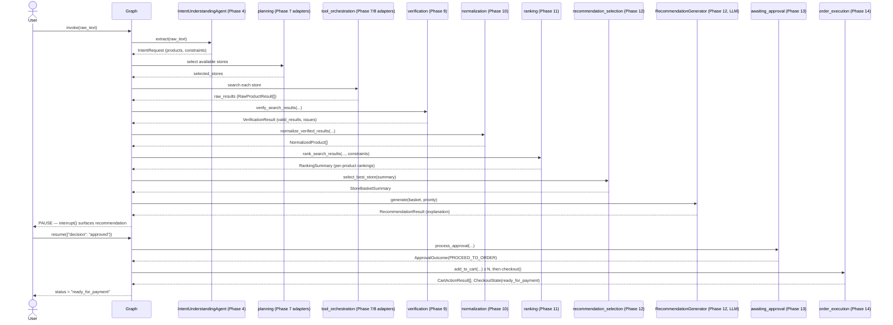

# Phase 15 — Integration Testing

> **Status:** Every standalone layer built since Phase 7 is now wired into
> the real LangGraph workflow. Phase 5's mocks are gone. This is the
> integration point every phase since Phase 7 explicitly deferred to.

---

## 1. Goal

Connect Phases 7–14 into `app/graph/`, replacing every mock node from
Phase 5 with real logic, and prove the complete flow works end-to-end —
intent → plan → search → verify → normalize → rank → recommend → approve
→ order — using Phase 7's deterministic mock adapters (no real device
needed) so the integration itself, not device flakiness, is what's
being proven.

---

## 2. What Changed, Concretely

| Node | Phase 5 (mock) | Phase 15 (real) |
|---|---|---|
| `planning` | `app.graph.mocks.select_mock_stores` | Filters injected `StoreAdapter`s by `is_available()` |
| `tool_orchestration` | `app.graph.mocks.search_mock_store` | Calls each selected adapter's real `.search()`, tolerating partial failures |
| `verification` | `price > 0` filter only | Full Phase 9 `verify_search_results()` |
| `normalization` | Pass-through | Full Phase 10 `normalize_verified_results()` |
| `ranking` | Naive price sort | Full Phase 11 `rank_search_results()`, honoring `Constraints.priority` |
| `recommendation_generation` | Templated string, no LLM | Phase 12 `select_best_store()` + LLM-backed `RecommendationGenerator` |
| `awaiting_approval` | Bare string decision | Phase 13 `ApprovalSubmission` → `process_approval()` |
| `order_execution` | Fabricated confirmation | Phase 14 real `add_to_cart`/`checkout` via adapters |
| — | `"confirmed"` terminal status | **`"ready_for_payment"`** (safety rename, see §3) |

`app/graph/mocks.py` is deleted — its own docstring called this moment
exactly right: "replaced wholesale once real store catalogs exist."

---

## 3. The Safety-Motivated Rename

Phase 14's automation stops *before* payment confirmation, by design.
Phase 5's terminal status for a successful run was called `"confirmed"`.
Sitting those two facts next to each other is exactly the kind of
ambiguity this project has worked hard to avoid — someone skimming logs
or a status field could misread `"confirmed"` as "payment was confirmed."
Renamed to **`"ready_for_payment"`** everywhere: the `GraphStatus` type,
the terminal node (`ready_for_payment_node`, was `confirmed_node`), and
every test. Guarded by `test_ready_for_payment_is_a_valid_status_literal`.

---

## 4. Two Integration Decisions Only Visible at This Level

**Bridging `NormalizedProduct` back to `RawProductResult`.** Phase 7's
`StoreAdapter.add_to_cart(product: RawProductResult)` was explicitly
flagged there as provisional, pending Phase 10/11 types existing. Now
they do — but changing the Protocol would cascade through every adapter
and their already-passing test suites. `order_execution.py`'s
`_normalized_to_raw()` bridges the two at the one integration point that
needs it, resolving the flagged decision without the cascade.

**A new conditional edge after `recommendation_generation`.** Tracing
the real pipeline surfaced a gap Phase 5's mock-driven design never hit:
if nothing survives Ranking, `recommendation.store_id` is `None`, and
Phase 13's `process_approval` explicitly *raises* if you try to approve
that. Phase 5's graph would have paused for approval on nothing. Fixed
with `route_after_recommendation`: skip straight to `failed` when there's
no viable store.

---

## 5. Sequence Diagram — Full Happy Path



---

## 6. Data Flow — Type Transformations at Each Boundary

```mermaid
flowchart LR
    A["raw_text: str"] -->|Phase 4 LLM| B["IntentRequest<br/>products, constraints"]
    B -->|Phase 7 adapters| C["list of RawProductResult<br/>string-typed, unverified"]
    C -->|Phase 9| D["VerificationResult<br/>valid_results + issues"]
    D -->|Phase 10| E["list of NormalizedProduct<br/>fully typed"]
    E -->|Phase 11| F["RankingSummary<br/>per-product rankings"]
    F -->|Phase 12 selection| G["StoreBasketSummary<br/>one store, whole basket"]
    G -->|Phase 12 LLM| H["RecommendationResult<br/>explanation text"]
    H -->|Phase 13| I["ApprovalOutcome<br/>PROCEED_TO_ORDER"]
    I -->|"Phase 14, bridged via _normalized_to_raw"| J["CartActionResult list<br/>CheckoutState"]
```



Every arrow crosses exactly one phase's boundary — no layer reaches past
its neighbor, matching the dependency graph from Phase 0 §9.

---

## 7. Failure Scenarios and Recovery Strategies

| Scenario | Where it's caught | Recovery |
|---|---|---|
| **One store's automation fails** | `tool_orchestration` catches per-adapter exceptions | Logged and skipped; other stores' results still flow through (Phase 0 §12's "partial failure" policy) — tested (`test_tool_orchestration_node_continues_past_failed_store`). |
| **Every store fails / returns nothing** | `route_after_tool_orchestration` | Bounded retry (`retry_orchestration`, up to `MAX_RETRIES=2`), then `failed` — unchanged from Phase 5, still correct. |
| **Results exist but all get rejected** (bad prices, duplicates) | `verification` → empty `valid_results` | Cascades naturally: normalization/ranking produce empty outputs, `select_best_store` returns `None`, `route_after_recommendation` sends it to `failed` — no new special-case code needed; the pipeline's own empty-input handling (each phase already tested for this) composes correctly. |
| **A hard constraint excludes everything** (e.g. impossible budget) | `ranking`'s `apply_hard_constraints` | Same cascade as above — tested explicitly (`test_modify_with_excluding_budget_yields_failed_not_a_second_pause`). |
| **Vague/ambiguous request** | `route_after_intent` | Ends immediately at `needs_clarification_end`, never reaches planning or the LLM again — unchanged from Phase 4/5. |
| **User rejects the recommendation** | `route_after_approval` | `cancelled`, terminal. |
| **User wants a different constraint** | `route_after_approval` → `updated_constraints` threaded into `intent` | Loops back through `planning`; if the new constraints still find something, pauses for approval again (a genuine, tested cycle); if not, cascades to `failed` exactly like the constraint-exclusion case above. |
| **User wants to restate the whole request** | `route_after_approval` → `updated_raw_text` | Loops all the way back to `intent_understanding` — a full re-extraction, not just re-planning. |
| **Add-to-cart fails for one item** | `order_execution` checks `all(r.success for r in cart_results)` | `failed`, with the specific failed product names in `error_message` — no partial order is left in an ambiguous state. |
| **Checkout fails / never reaches payment screen** | `order_execution` checks `checkout_state.status` | `failed`, never `ready_for_payment` — and, per Phase 14, the automation structurally cannot have tapped a payment button regardless. |

---

## 8. Manual Testing & Verification

```bash
cd backend
source .venv/bin/activate
pip install -r requirements-dev.txt

pytest tests/graph/ -v
```

**Expected:** 27 tests pass (2 state + 18 node/routing + 7 full end-to-end
workflow tests).

### The tests worth reading yourself

- `test_full_happy_path_reaches_ready_for_payment` — the complete flow,
  start to finish, using real Phase 7 adapters.
- `test_modify_with_satisfiable_change_loops_through_planning_and_pauses_again`
  — proves the modify cycle is a genuine, working loop, not a dead end.
- `test_no_results_found_skips_approval_entirely` — proves the new
  conditional edge (§4) actually works.

---

## 9. Debugging Guide

| Symptom | Likely cause | Fix |
|---|---|---|
| Graph reaches `failed` immediately after `tool_orchestration` | All injected adapters are Phase 8/14 Appium adapters with still-placeholder locators | Use Phase 7's mock adapters (`get_all_store_adapters()`) for testing, or complete the Appium Inspector steps from Phase 8 §6 for real automation. |
| `route_after_recommendation` always returns `"failed"` | `RecommendationGenerator` was passed `basket=None` from every call — check `select_best_store`'s inputs (is `ranking_summary.rankings` actually populated?) | Trace back through `ranking_node`, `normalization_node`, `verification_node` in order — one of them is producing empty output unexpectedly. |
| `ApprovalSubmission.model_validate(...)` raises inside `awaiting_approval_node` | The resumed value's shape doesn't match `ApprovalSubmission`/`ModifyRequest` | Check the exact dict passed to `Command(resume=...)` against Phase 13's contract — see `awaiting_approval_node`'s interrupt payload message for the expected shape. |

---

## 10. Acceptance Criteria

- [ ] `pytest tests/graph/ -v` — 27/27 pass.
- [ ] `pytest tests/ -v` (the full suite) — all pass, confirming nothing outside `graph/` broke.
- [ ] `grep -r "MockProductResult\|app.graph.mocks" app/` — no output (Phase 5's mocks fully retired).

---

## 11. Verification Checklist

- [x] All new/changed files pass `py_compile`.
- [x] Every node function individually runtime-verified in this sandbox
      (offline pydantic stub + a stubbed `langgraph.types.interrupt`):
      `planning_node` (availability filtering), `tool_orchestration_node`
      (partial-failure tolerance), the full verification →
      normalization → ranking chain, `recommendation_generation_node` +
      both branches of `route_after_recommendation`, ALL FOUR branches
      of `route_after_approval` (approved, rejected, modify-constraints,
      modify-raw-text) including the constraint-merge and raw-text
      re-routing behavior, `order_execution_node` (success, cart
      failure, checkout failure, no-basket), and the
      `_normalized_to_raw` bridge.
- [x] One real bug caught by this verification and fixed before
      shipping: `app/graph/state.py` imported `ApprovalOutcome` from the
      wrong module (`domain.approval` instead of `processing.approval`)
      — caught immediately on the first import attempt, not left for a
      test run to discover.
- [x] Full `StateGraph` compile/invoke/interrupt/resume — **not run in
      this sandbox** (no network to install `langgraph`), same
      limitation as every previous graph-touching phase. `test_workflow.py`
      is what actually proves the wiring; please run it for real.

---

## 12. Known Limitations

- `build_graph()` defaults (via DI) to Phase 7's mock adapters — genuine
  device automation requires manually swapping in Phase 8/14's real
  adapters, which in turn requires completing Phase 8's Appium Inspector
  steps first. Nothing in this phase changes that dependency.
- `_normalized_to_raw`'s bridge is lossy in one direction: a
  `NormalizedProduct`'s already-parsed `price_inr`/`eta_minutes` get
  re-stringified back into `RawProductResult`'s raw format, then would
  be re-parsed if that data flowed through Verification/Normalization
  again. This never actually happens in the current graph (the bridge
  only feeds `add_to_cart`, not back into the pipeline), but it's a
  slightly awkward round-trip worth knowing about.
- No API endpoints wired to this graph yet — Phase 13 deferred that for
  the same reason (no request-tracking/persistence system exists). The
  graph is fully real and fully tested; it's just not yet reachable via
  HTTP.

## 13. Improvements to Consider Later

- Build the request-tracking/persistence layer and the actual
  `POST /v1/requests` + `/approve|reject|modify` endpoints, wiring them
  to `get_shopping_graph()`.
- Add a bounded `modify_count` safeguard (flagged back in Phase 5) now
  that the modify cycle is genuinely exercised.
- Once real Appium locators exist for at least one store, add an
  integration test variant using the real adapter instead of the mock,
  to validate the same wiring against actual device automation.

---

## Next Step

This completes the master phase plan (Phase 0 through Phase 15). The
project is architecturally whole: every layer built, tested, and now
wired together. Remaining work is explicitly deferred and documented
(§12/§13) — real locator values, API/persistence layer, and device-level
validation — none of which block the architecture itself from being
considered complete.
