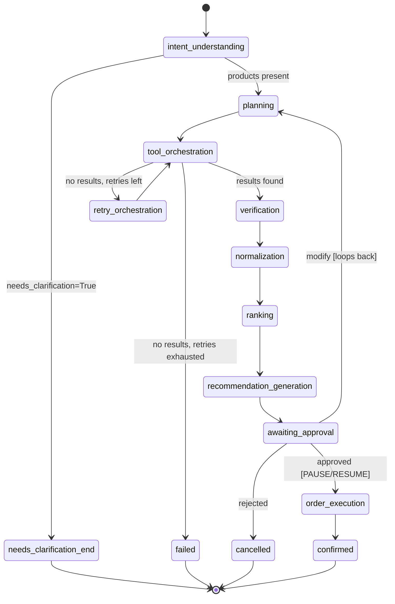

# Phase 5 — LangGraph Foundation

> **Status:** Full graph topology wired and compiled, with real
> pause/resume via `interrupt()`. Intent Understanding is real (Phase 4);
> every other node is a deterministic, clearly-labeled mock. No Appium yet.

---

## 0. Deferred fix landed first: `Constraints.priority` is now `Optional`

Before any Phase 5 work, the fix flagged (and deliberately deferred) at
the end of Phase 4 was implemented:

- `Constraints.priority: Priority | None = None` — no longer defaults to
  `BEST_VALUE`. An unstated preference is now represented honestly as
  `None`; applying a default is the Ranking Engine's job (Phase 11), not
  the extraction layer's.
- The LLM-facing schema (`_ExtractedConstraints` in `intent_agent.py`)
  gained a 4th enum value, `_ExtractedPriority.UNSPECIFIED`, kept
  **required and non-nullable** — reusing the exact lesson from the
  Incident-1 bugfix (nullable + non-required fields are unreliable for
  schema-constrained decoding). `_to_domain_constraints()` maps
  `UNSPECIFIED → None`, same pattern as the existing `0 → None` sentinel
  conversion for the numeric fields.
- `intent_extraction.txt` updated: priority is now `cheapest` / `fastest`
  / `best_value` (only when the user explicitly asks for balance/good
  deal) / `unspecified` (no relevant wording at all).
- Tests updated across `test_constraints.py` and `test_intent_agent.py`;
  3 new tests added (unspecified→None mapping, schema-shape guard, plain
  `priority=None` construction). **Full domain+agent suite: 62 tests**
  (6+7+9+40, up from 59 — see the running total below for Phase 5's own
  additions).

This is why `app/graph/nodes/ranking.py`'s docstring explicitly flags that
its naive price-sort stub is a placeholder for Phase 11's real
priority-aware ranking, which will read `Constraints.priority` and be the
one place that decides what "no preference" defaults to.

---

## 1. Goal

Prove the entire Phase 0 §4 state diagram is a real, executable graph —
not just a diagram. Every node and edge from that design now exists in
code, compiled and runnable, using the real Phase 4 agent for intent
understanding and deterministic mocks everywhere else (no other phase's
real logic exists yet).

---

## 2. Concepts to Learn From This Phase

- **`StateGraph` + `TypedDict` state schema** — why LangGraph's
  documented pattern uses `TypedDict` for the state shape itself, with
  domain objects as field *values*.
- **Conditional edges as pure functions** — `route_after_intent`,
  `route_after_tool_orchestration`, `route_after_approval` each just read
  state and return a string key; LangGraph handles the actual branching.
- **`interrupt()` vs. static `interrupt_before=[...]`** — dynamic,
  in-node pausing that both surfaces data to a human and receives a
  decision back, backed by a checkpointer.
- **Checkpointing and `thread_id`** — why pause/resume requires a
  persistence layer (`InMemorySaver` here; swappable for Postgres later
  per Phase 0 §17) and a stable identifier per shopping request.
- **Graph cycles** — the `modify → planning` edge is a genuine loop, not
  a one-way flowchart; tested explicitly (`test_modify_path_loops_...`).

---

## 3. Architecture Fit

Implements `graph/` from Phase 0 §2/§9 — the orchestration layer that
depends on `agents/` (real, for intent) and, eventually, `services/` and
`adapters/` (mocked here, real from Phase 6/7 onward). `graph/` has no
dependency on `automation/` or `adapters/` directly — mocks live in
`app/graph/mocks.py`, isolated so Phase 7's real adapters can be swapped
in at the node level without rewiring the graph itself.

---

## 4. Folder Structure (this phase's additions in bold)

```
backend/app/graph/
├── state.py                    **GraphState (TypedDict) + MockProductResult**
├── mocks.py                      **deterministic mock planning/search**
├── workflow.py                    **build_graph() — full topology**
└── nodes/
    ├── intent_understanding.py     **real agent + routing**
    ├── planning.py                   **mock**
    ├── tool_orchestration.py          **mock + retry loop**
    ├── verification.py                 **stub**
    ├── normalization.py                 **stub**
    ├── ranking.py                        **stub**
    ├── recommendation.py                  **stub**
    ├── approval.py                         **real interrupt()/resume**
    ├── order_execution.py                   **stub**
    └── terminal.py                            **confirmed/cancelled/failed/needs_clarification**

backend/tests/graph/
├── test_state.py           **new**
├── test_mocks.py             **new**
├── test_nodes.py               **new**
└── test_workflow.py              **new — full graph runs incl. pause/resume**
```

`app/core/dependencies.py` gets `get_shopping_graph()`.

---

## 5. The Graph, Visualized

This is the actual implemented topology — every node and edge below
exists in `app/graph/workflow.py`, not an aspirational diagram.



**Real vs. mock, at a glance:**

| Node | Real or mock? | Why |
|---|---|---|
| `intent_understanding` | **Real** | Phase 4's fully-built, twice-hardened agent |
| `planning` | Mock | No dedicated phase yet; always returns all 3 mock stores |
| `tool_orchestration` | Mock | No Appium (Phase 6) or real adapters (Phase 7) yet |
| `retry_orchestration` | Real *mechanism*, mock *trigger* | The loop and counter are real; only a deterministic test hook (`UNAVAILABLE_PRODUCT_TRIGGER`) can cause a failure right now |
| `verification` / `normalization` / `ranking` | Stub | Each is an entire future phase (9/10/11) |
| `recommendation_generation` | Stub (templated text) | Phase 12's job to make this LLM-generated |
| `awaiting_approval` | **Real** | The actual `interrupt()`/`Command(resume=...)` mechanism Phase 13 builds on |
| `order_execution` | Mock | Phase 14's job |

---

## 6. File-by-File Explanation

### `app/graph/state.py`
`GraphState` is a `TypedDict` — the documented LangGraph pattern for
node-update merging (verified against current LangGraph docs/examples
before writing this, not assumed from older training data). Each field's
owning node is documented in the class docstring. `MockProductResult` is
a private, Phase-5-only Pydantic type — explicitly not the real
`NormalizedProduct` Phase 10 will define, so this phase never guesses at
that future contract.

### `app/graph/mocks.py`
`select_mock_stores()` and `search_mock_store()` are pure, fully
deterministic functions — no randomness anywhere, so ranking outcomes
and test assertions are 100% reproducible. `UNAVAILABLE_PRODUCT_TRIGGER`
is a magic product name that deterministically makes a mock store search
return nothing, giving the retry/failed path something real to test
without needing actual automation errors (which don't exist until
Phase 6).

### `app/graph/nodes/intent_understanding.py`
`make_intent_understanding_node(agent)` is a closure factory — same DI
pattern as everywhere else in this project (Phase 2's `Depends`, Phase 4's
constructor injection). Tests inject a `_StubIntentAgent` instead of a
real LLM-backed one. `route_after_intent` is the first conditional edge:
a `needs_clarification=True` intent never reaches Planning at all — this
is Phase 4's `needs_clarification` field finally being *acted on* by the
graph, not just carried as inert data.

### `app/graph/nodes/tool_orchestration.py`
Aggregates mock results across every selected store.
`route_after_tool_orchestration` implements the bounded retry: success →
`verification`; empty results with retries remaining →
`retry_orchestration`; empty results with retries exhausted → `failed`.
`retry_orchestration_node` just increments a counter — the real
"automation retry" behavior (re-running a flaky Appium interaction)
arrives with real automation in Phase 6+; this proves the graph *shape*
of retrying is correct now.

### `app/graph/nodes/verification.py` / `normalization.py` / `ranking.py`
Each is a deliberately minimal stub with a docstring naming exactly which
future phase replaces it and why it isn't built out now (each is a
full phase of its own in the master plan). `ranking.py` specifically
flags that it ignores `Constraints.priority` entirely — that's Phase
11's job, and doing it properly now would mean guessing at Phase 11's
design.

### `app/graph/nodes/recommendation.py`
Plain string template, no LLM call — Phase 12 decides how the LLM should
explain a recommendation; this stub only proves the graph can carry a
recommendation string forward to the approval step.

### `app/graph/nodes/approval.py`
The one node besides intent understanding that's genuinely real, not a
mock. `awaiting_approval_node` calls `interrupt()` with a payload
(`recommendation` + a prompt message) — this pauses graph execution,
persists exact state via the checkpointer, and returns whatever value the
caller later supplies via `Command(resume=...)`. `route_after_approval`
handles three outcomes: `approved` → `order_execution`, `modify` →
**loops back to `planning`** (a genuine cycle, not a dead end — tested
explicitly), anything else → `cancelled`.

### `app/graph/nodes/order_execution.py` / `terminal.py`
Stub order confirmation and four trivial terminal nodes, each existing so
future phases (15's integration logging, a future cancellation
notification) have one clear place to hang side effects off, rather than
inlining status-setting into edge conditions.

### `app/graph/workflow.py`
`build_graph(intent_agent)` wires all 14 nodes and every edge shown in
§5, then `.compile(checkpointer=InMemorySaver())`. The checkpointer isn't
optional — without it, `interrupt()` has nowhere to persist paused state,
and pause/resume simply doesn't work.

---

## 7. Manual Testing & Verification

> **This sandbox has no network access and could not install/run
> `langgraph` for real.** Everything below was verified as far as
> possible offline (see §11), but the actual `StateGraph`
> compile/invoke/interrupt/resume mechanics were **not** executed here —
> only reasoned about against LangGraph's documented API (verified via
> search before writing any of this code, including the exact
> `result["__interrupt__"]` / `Command(resume=...)` pattern). Please run
> the commands below for real before approving this phase.

```bash
cd shopping-agent/backend
source .venv/bin/activate
pip install -r requirements-dev.txt   # if not already done

pytest tests/domain/ tests/agents/ tests/graph/ -v
```

**Expected:** 102 tests pass — 62 from Phases 2–4 (6+7+9+40, after the
priority fix) + 40 new in Phase 5 (4+7+24+5).

### Manually exercise pause/resume

```python
# From backend/, with venv active: python3
import uuid
from app.graph.state import initial_state
from app.core.dependencies import get_shopping_graph

graph = get_shopping_graph()
config = {"configurable": {"thread_id": str(uuid.uuid4())}}

# This will actually call your real Ollama/Qwen setup via the real
# IntentUnderstandingAgent -- have Ollama running, or swap in a stub
# agent as the tests do.
result = graph.invoke(initial_state("I need onions, cheapest, 20 minutes"), config)
print("Paused:", "__interrupt__" in result)
print(result.get("__interrupt__"))

from langgraph.types import Command
final = graph.invoke(Command(resume="approved"), config)
print("Final status:", final["status"])
print(final["order_confirmation"])
```

**Expected:** first call prints `Paused: True` and shows the
recommendation payload; second call prints `Final status: confirmed` and
a mock order confirmation.

---

## 8. Debugging Guide

| Symptom | Likely cause | Fix |
|---|---|---|
| `graph.invoke()` runs straight through with no `__interrupt__` | Checkpointer missing, or a new `thread_id` used on the "resume" call | Confirm `build_graph()` compiled with `checkpointer=InMemorySaver()`, and that the exact same `config` dict (same `thread_id`) is reused for both calls. |
| `KeyError: 'intent'` inside a downstream node | A node ran before `intent_understanding` set it — shouldn't happen given the edges, but check custom test states include all `GraphState` keys | Use `initial_state()` to construct test states, not a hand-rolled partial dict. |
| Retry loop never reaches `failed` | `MAX_RETRIES` in `tool_orchestration.py` — confirm the test's expectations match its current value | `route_after_tool_orchestration` compares `retry_count < MAX_RETRIES`; adjust test assertions if that constant changes. |
| `modify` doesn't loop, ends the run instead | `route_after_approval`'s mapping in `add_conditional_edges` missing the `"planning": "planning"` entry | Check `workflow.py`'s conditional edge mapping for `awaiting_approval`. |

---

## 9. Edge Cases Considered

- **`needs_clarification=True` intent never pauses for approval** —
  there's nothing to approve; the graph ends immediately at
  `needs_clarification_end` (tested explicitly).
- **Every store search fails** (`UNAVAILABLE_PRODUCT_TRIGGER`) — bounded
  retry, then `failed` with a real error message, not an infinite loop
  (bounded by `MAX_RETRIES`, tested).
- **Repeated `modify`** — each `modify` re-runs `planning` through
  `awaiting_approval`, pausing again each time; the loop only terminates
  via `approved` or `rejected`. Not explicitly tested for more than one
  cycle, but the mechanism (a normal conditional edge) has no cycle
  limit — worth adding a bounded-modify-count safeguard in a later phase
  if real usage shows this matters (flagged in §12).

---

## 10. Acceptance Criteria

- [ ] `pytest tests/domain/ tests/agents/ tests/graph/ -v` — 102/102 pass.
- [ ] The manual pause/resume script in §7 prints `Paused: True` then
      `Final status: confirmed`.
- [ ] `app/graph/nodes/ranking.py`, `verification.py`, `normalization.py`
      contain no LLM calls (grep for `StructuredLLMService`/`LLMClient` —
      should find nothing).

---

## 11. Verification Checklist

- [x] All new files pass `py_compile`.
- [x] All pure-logic pieces runtime-verified in this sandbox: mock
      store search (determinism + per-store price variation + failure
      trigger), every routing function (`route_after_intent`,
      `route_after_tool_orchestration`, `route_after_approval`) against
      every branch, and every node function
      (verification/normalization/ranking/recommendation/terminal)
      against representative inputs.
- [x] Full `StateGraph` compile/invoke/interrupt/resume — **confirmed
      by user**: full suite (118 tests) passes clean after the
      `langgraph` version-pin fix in §14.
- [x] Priority deferred-fix tests updated and syntax-verified; sentinel
      mapping (`unspecified → None`) runtime-verified offline.
- [x] `graph/` has no dependency on `automation/` or `adapters/` —
      verified by inspection of every import in `app/graph/`.

---

## 12. Known Limitations

- No bound on repeated `modify` cycles — a user could loop
  `awaiting_approval → planning → ... → awaiting_approval` indefinitely.
  Not a correctness bug (each cycle is a legitimate re-plan), but worth a
  max-modify-count safeguard if real usage shows it's needed.
- `tool_orchestration`'s only failure mode is the deterministic test
  trigger — real transient-failure semantics (partial store failures,
  timeouts) don't exist until Phase 6 gives it real automation to fail.
- `InMemorySaver` means all paused state is lost on process restart —
  correct for local MVP, explicitly flagged in Phase 0 §17 as needing a
  durable checkpointer (Postgres-backed) before any real deployment.
- The graph was designed and code-reviewed against LangGraph's documented
  API (verified via search), but never executed against the real library
  in this environment — treat `test_workflow.py` passing locally as the
  actual acceptance signal, not this document's confidence alone.

## 13. Improvements to Consider Later

- Add a `modify_count` field to `GraphState` and a bounded-loop safeguard
  once real usage patterns exist to design against.
- Once Phase 6/7 land real automation and adapters, `tool_orchestration`
  gains real transient-failure semantics — the retry loop built here
  should need no rewiring, only a real implementation swapped into the
  node.
- Consider a Postgres-backed checkpointer (Phase 0 §17) once this moves
  past local development.

---

## 14. Bugfix Log: stale `langgraph` version pin broke interrupt detection

**Discovered:** live `pytest` run. 116/118 passed; both failures were in
`test_workflow.py` — `test_happy_path_pauses_for_approval_then_confirms`
and `test_modify_path_loops_back_to_planning_and_pauses_again` — both on
`assert "__interrupt__" in result`.

**Diagnosis, not guesswork:** the returned state in both failures showed
`approval_decision: None`, `order_confirmation: None`,
`status: "in_progress"` — exactly the state *before*
`awaiting_approval_node` completes. If the interrupt hadn't fired,
`route_after_approval` would have mapped `None` → `"cancelled"` and
`status` would read `"cancelled"`, not `"in_progress"`. The graph was
genuinely pausing correctly; only detecting that pause via
`result["__interrupt__"]` was failing.

**Root cause:** `backend/requirements.txt` pinned `langgraph>=0.2,<0.3` —
set during Phase 1, before Phase 5's design (or its need for `interrupt()`)
existed. Per LangGraph's own changelog, **automatic surfacing of
interrupts in `.invoke()`'s return value was added in v0.4** — the
`0.2.x` range predates that convenience entirely. The `interrupt()` /
`Command(resume=...)` code in `app/graph/nodes/approval.py` was correct
against LangGraph's current API (verified via search before writing it,
in the original Phase 5 design step) — the version constraint beneath it,
set four phases earlier, was not.

**Fix:** `requirements.txt` — `langgraph>=0.2,<0.3` →
`langgraph>=1.0,<2.0` (targeting the stable, GA API surface rather than
the pre-1.0 transitional range where the interrupt API was still
settling). **No changes to any node or workflow code** — the graph logic
was already correct; only the dependency floor was wrong.

**Verification status: CONFIRMED.** Full suite (118 tests) passes
clean after `pip install -r requirements.txt --upgrade`, including both
previously-failing tests in `test_workflow.py`. Pause/resume via
`interrupt()` / `Command(resume=...)` / `result["__interrupt__"]` is now
verified working end-to-end, not just reasoned about against documented
API behavior.

---

## Next Step

Once `pytest` passes locally (102/102) and the manual pause/resume script
in §7 behaves as expected, say **"Move to Phase 6"** to begin the Appium
Foundation — device connection, driver management, and basic interaction,
still without any real store automation.
